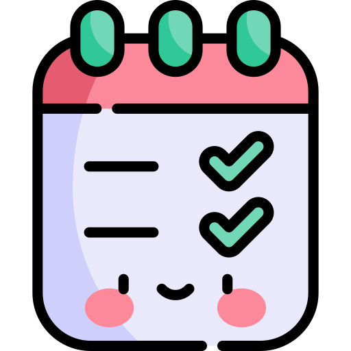

<!-- Title -->

  
  <h1>React To-Do List</h1>

## 📌 Overview

The React To-Do List is a user-friendly web application created with React. It offers an elegant and straightforward interface for managing your tasks effectively. You can easily add, edit, and remove tasks, all in one place. 🚀

<!-- Live Demo -->
## 🌐 Live Demo

Explore a live demonstration of the application:  
<a href=https://douaekanjaa.github.io/Tp3_react/>
  
  Live Demo
  
</a>

<!-- Features -->
## ✨ Key Features

- **Add Tasks:** Quickly add new tasks with ease.
- **Edit Tasks:** Edit task details on-the-fly.
- **Remove Tasks:** Remove tasks you no longer need.
- **Responsive Design:** Works seamlessly on various devices.
- **Task Completion Status:** Track your task progress (coming soon).

## 🛠️ Technologies Used

The React To-Do List is built with the following technologies:

- **React:** 🚀 A popular JavaScript library for building user interfaces.
- **uuid:** 🔑 Used for generating unique task identifiers.
- **CSS:** 🎨 For crafting the elegant user interface.

## Author 👩‍💻

- Kanjaa Douae

